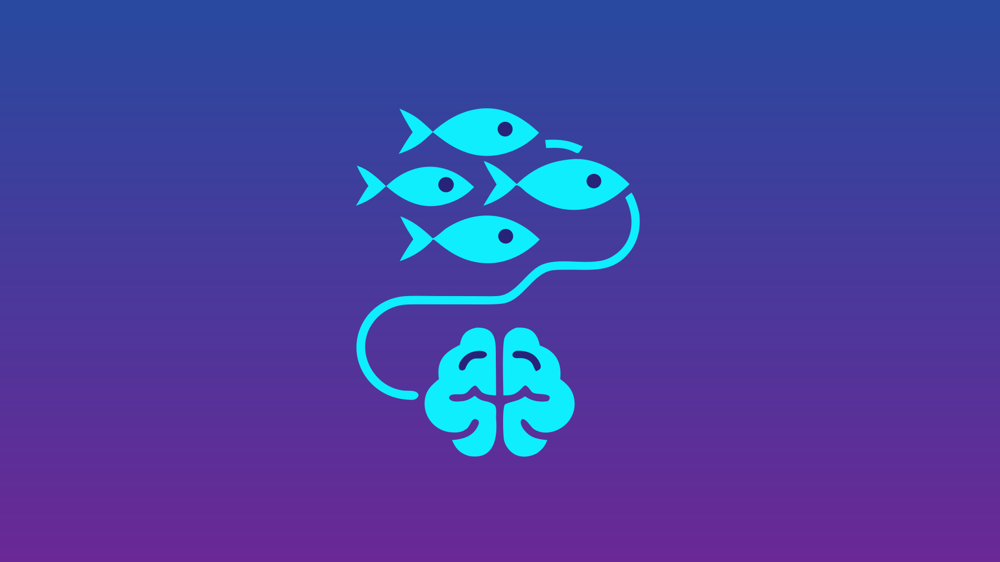

# Shoal AI

<p align="center"></p>

Part of **Shoal**, a family of Jellyfin plugins that work together: [Shoal
Ingest](https://github.com/chrisgrulau/jellyfin-ingest) files new media into your libraries, [Shoal
Subtitles](https://github.com/chrisgrulau/jellyfin-subtitles) finds, checks and synchronises subtitles, and [Shoal
AI](https://github.com/chrisgrulau/jellyfin-ai) gives both optional AI help. Each works on its own; installed together,
they help each other.

A [Jellyfin](https://jellyfin.org) plugin that gives the other plugins in the family
([Ingest](https://github.com/chrisgrulau/jellyfin-ingest), [Subtitles](https://github.com/chrisgrulau/jellyfin-subtitles))
optional, budget-controlled access to AI models, for decisions they can't make on their own: which of two close
candidate titles a release is, or whether a subtitle really matches the dialogue.

> **Status:** alpha. Anthropic (Claude), OpenAI, Google Gemini and OpenAI-compatible services (a local Ollama server,
> OpenRouter, Groq …) within the spending limits, a default provider with fallbacks, a prepaid-credit countdown, provider
> health with a banner, and the entry point the other plugins use are in place.

## Installing

**From the Shoal plugin repository (recommended):** in **Dashboard → Plugins → Repositories**, add
`https://raw.githubusercontent.com/chrisgrulau/jellyfin-shoal/main/manifest.json`, install **Shoal AI** from the
catalogue and restart Jellyfin. Updates install automatically unless you switch that off for the plugin under **My
Plugins**.

**By hand:** download `jellyfin-plugin-ai.zip` from the [releases](../../releases), check it against `SHA256SUMS` (and,
if you like, `gh attestation verify jellyfin-plugin-ai.zip --repo chrisgrulau/jellyfin-ai`), and put **all six DLLs**
it contains (`Jellyfin.Plugin.Ai.dll`, `Anthropic.dll`, `Microsoft.Extensions.AI.Abstractions.dll`, `OpenAI.dll`,
`System.ClientModel.dll`, `System.Memory.Data.dll`) in `<jellyfin data>/plugins/AI_<version>/`, then restart Jellyfin.

Then open **Dashboard → Plugins → Shoal AI**: add a key for a provider (or the address of a local OpenAI-compatible
server), press **Test**, choose which provider answers, and allow Ingest and Subtitles to use it. Nothing is sent
anywhere until you do.

Uninstalling leaves the plugin's data folder (`keys.json`, `spend.json`, `rates.json`, `calls.jsonl`, `health.json`); delete it by hand if you like.

## How it fits together

- **Optional everywhere.** Ingest and Subtitles work fully without this plugin. When it is installed, and you allow
  them to, they ask it for a tiebreak; otherwise they leave hard cases for your review, as before.
- **Providers.**
  - **Anthropic (Claude)**, using Claude Opus 5.5 unless you pin another model (USD 4 / 20 per million input / output
    tokens; a tie-break costs a fraction of a cent, a transcript comparison a few cents).
  - **OpenAI (GPT)** and **Google Gemini**: you choose the kind of model (OpenAI: balanced, most capable or cheapest;
    Gemini: Flash, Pro or Flash-Lite) and the plugin uses the newest one of that kind the provider offers, checked once a
    day (a change is noted in the server log). By default GPT-6 Sol (USD 2 / 10) and Gemini 3.8 Flash (USD 0.75 / 3.75).
  - **Any OpenAI-compatible service**: a local server such as Ollama, LM Studio or vLLM, or OpenRouter, Groq and the
    like. Enter its address, the model and a key if it needs one. On this machine or the local network it is free and
    has no limit; a remote one needs its prices (under Advanced) or to be marked free, and if it reports what each call
    cost (OpenRouter does) that is what's recorded.

  Pinning a model (under Advanced) overrides the automatic choice: it may cost more, and the provider may retire it.
- **Which provider answers.** One provider answers (Anthropic unless you choose another), and you can name up to three
  to try next if it can't: when it isn't set up, can't be reached, refuses the key, is out of credit or over its limit,
  or is failing for now. A request it answered but that couldn't be used isn't sent again (it was already paid for).
- **Problems are shown, not hidden.** A refused key, used-up credit or repeated failures put a banner at the top of the
  settings page saying what to do for that provider; a one-off failure (retried anyway) stays in the call log only.
- **Spending limits** in your own currency: an overall monthly limit for all paid providers (5 a month by default; 0
  means no paid use; "no limit" is an explicit choice with a warning), plus, if you like, a limit per provider as an
  amount or a share of the overall limit. Providers' charges (usually US dollars) are converted with the European
  Central Bank's daily rates, with an optional percentage for taxes or card fees. Local services cost nothing.
- **One budget page for the family.** Shoal Subtitles' paid speech-to-text (Deepgram, OpenAI) is kept within the same
  limits and currency: its spending shows here, with a limit row for each service, and Subtitles' own spending
  settings are hidden. Its keys stay in Subtitles; only amounts are exchanged. **Allow Subtitles to use this budget
  for paid speech-to-text** is on by default; untick it (or uninstall this plugin) and Subtitles uses its own limit
  again.

## Privacy

Nothing is sent anywhere until you allow a plugin to use AI, and then only to the providers you enable. Never file
paths, user names, or anything from home video and photo libraries. What each plugin sends:

| From | When | What |
|---|---|---|
| Ingest | A close match | The file name; candidate titles, years and kinds |
| Ingest | An episode named by title, or with no usable name | Also the season's episode titles, years and short synopses; for no usable name, up to 4,000 characters of transcribed dialogue |
| Subtitles | The wording differs from what is said, or an audit | The subtitle language, a few minutes of heard phrases and the subtitle lines around them |

See [SECURITY.md](SECURITY.md) and [docs/DESIGN.md](docs/DESIGN.md).

### The call log

The settings page lists recent AI calls, 15 at a time with **Show more** (filterable by plugin), and shows the last
error while nothing has succeeded since. Each call reads as one line: what happened ("Ingest asked which film or show
this is — answered", "Subtitles checked wording — refused: monthly limit reached"), an outcome icon (✅ answered, ⛔
refused by the spending limits, ⚠ failed; hover for the words), when (relative, with the exact time on hover), the
cost and how long it took. Open a row (▸) for its details.

For each call (from Ingest, Subtitles or the **Test** button) the log keeps: the time, the plugin and purpose
(`ingest.match` …), the provider and model, the outcome (answered, refused by the spending limits, or failed and why),
the tokens billed, the cost (in the provider's currency, and in yours when exchange rates are known), how long it took,
and either a summary of the answer's shape (field names, numbers and yes/no values; text only by its length) or the
error message, with API keys removed and cut to 300 characters.

**Never logged:** the instructions, data or schema sent (only their size in bytes), the text of the answer, file paths,
or API keys. Calls from a plugin you haven't allowed aren't logged either.

The log is `calls.jsonl` in the plugin's data folder, readable only by Jellyfin, and keeps the last 1,000 calls from the
last 30 days (at most 1 MB). Switch it off with **Keep a log of AI calls**, or empty it with **Clear log**.

## Settings

**Dashboard → Plugins → Shoal AI.** The page is grouped into sections you can fold away; the everyday ones are open:

- **What may use AI:** allow Ingest and Subtitles (**What is sent** explains what each sends).
- **Providers and keys:** which provider answers and which to try next; for each provider its key, the kind of model
  (or a compatible service's address and model), **Test** (shows the reply and what it cost) and, under **Advanced**, a
  pinned model with **List available models**, a prepaid credit to count down (the amount, the currency it was bought
  in, usually US dollars, and the date), or a compatible service's prices and **This service is free**.
- **Spending:** this month's spending against the limit, the currency, the overall monthly limit and whether Subtitles'
  paid speech-to-text uses this budget; folded away, a limit per provider (Deepgram and OpenAI speech-to-text are
  listed while Subtitles is installed) and a percentage for taxes or card fees.
- **Recent calls:** the call log (on by default; see [The call log](#the-call-log)).

API keys are kept in a file only Jellyfin can read, separate from the plugin settings. They are never shown again,
logged or included in exports; the settings page can only replace or clear them.

## Requirements

- Jellyfin 12.1
- An API key for Anthropic, OpenAI or Google Gemini, or an OpenAI-compatible service (a local one needs no key)

## Building

The shared source ([jellyfin-plugin-common](https://github.com/chrisgrulau/jellyfin-plugin-common)) is a git
submodule, so clone with `--recurse-submodules`, or fetch it in an existing clone; the build fails without
`external/common`:

```bash
git submodule update --init --recursive
dotnet build -c Release
```

Any .NET 10 SDK builds it (`global.json` sets the floor, so Linux distribution packages work), and package versions are locked in `packages.lock.json`. The Jellyfin
packages are pinned to the server version in `build.yaml`'s `targetAbi`; bump them together.

## Licence

[GPL-3.0](LICENSE), in line with Jellyfin's official plugins (the server itself is GPL-2.0).
